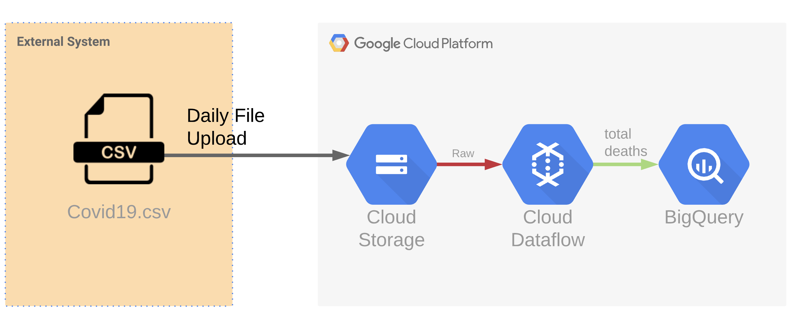

# Batch Workshop
This hands-on workshop, you would learn how to create a `Batch Data Pipeline` from scratch 
using Google Cloud Platform services.

- Google Cloud Storage
- Google Cloud Dataflow
- Google BigQuery
- Google Cloud IAM



You would create a new GCS bucket to store [`covid19_us_states.csv`](./resources/covid19_us_states.csv) which contains number of
infected people from each states; this is the public information provided by [New York Times](https://console.cloud.google.com/marketplace/product/the-new-york-times/covid19_us_cases?project=dataflow-demo-283112&folder=&organizationId=)

You would manually upload a `covid19_us_states.csv` file to the GCS bucket, to simulate a situation of daily COVID19 update,  then use
Cloud Dataflow to calculate a total number of deaths programmatically using Apache BEAM, and sink the calculated information into a specific BigQuery table. 

### What you would learn
- How manage GCS bucket with granular permissions
- Service account, and understand the GCP's IAM
- Cloud Dataflow, creating the batch data pipeline 
- Apache BEAM, to calculate total of deaths per states
- How to debug your data pipeline
- How to test your data pipeline
 

---

###Prerequisite
- [gcloud CLI](https://cloud.google.com/sdk/docs/quickstart-macos)
- GCP project with project owner permission
- Java 8.0 SDK
- A little prior knowledge in Cloud and Data Engineer
- IntelliJ IDE (Preferable)


---

## Labs Instruction
Please follow belows instructions carefully, in order to complete the workshop without any blockers.

### 1.) Service Account
Create a service account with empty permission
- name: `dataflow-demo`
- permission: `leave with empty`
- Download a service account file as `JSON`, and save to your local directory; this file will be used for 
[services authentication](https://cloud.google.com/docs/authentication/production).
- Configure environment variable to apply service account as below snippet
```bash
export GOOGLE_APPLICATION_CREDENTIALS="your/full/path/to/dataflow-demo-service-account.json"
```

### 2.) Storage
Create a GCS bucket to store temporary data and application package used by Cloud Dataflow.
Please follow this instruction: https://cloud.google.com/storage/docs/creating-buckets
- name: `batch_demo_[xxx]`
- upload [`covid19_us_states.csv`](./resources/covid19_us_states.csv) to the GCS bucket

### 3.) BigQuery
Create a dataset to store `total_deaths` information, please follow this instruction: 
https://cloud.google.com/bigquery/docs/datasets#create-dataset
- name `batch_demo`

### 4.) Dataflow
For this component, you need to checkout source code from this repository, and start an application at the file 
[BatchWorkshop.java](../src/main/java/org/rdp/googlecloud/BatchWorkshop.java) with following commands:

**Direct Runner:**
```bash
bash ./scripts/batch-direct-start.sh
```

**Dataflow Runner:**
```bash
bash ./scripts/batch-dataflow-start.sh
```

---
