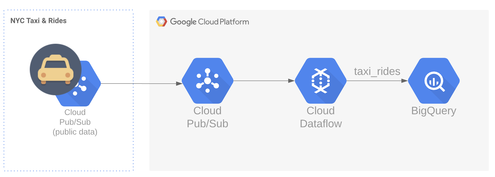

# Stream Workshop
This hands-on workshop, you would learn how to create a `Streaming Data Pipeline` from scratch 
using Google Cloud Platform services.
- Google Cloud PubSub
- Google Cloud Dataflow
- Google BigQuery

####The Overview of the Workshop



You would create a new subscriber to consume `taxi_rides`
information from public topic provided by [NYC Taxi Tycoon](https://github.com/googlecodelabs/cloud-dataflow-nyc-taxi-tycoon).
 Transforming messages into proper BigQuery table format using Google Cloud Dataflow, 
 then sink them into a specific BigQuery table.
 
### What you would learn
- How to subscribe to a public topic of GCP PubSub
- Service account, and understand the GCP's IAM
- Cloud Dataflow, creating the streaming data pipeline 
- Apache BEAM, for data processing
- How to debug your data pipeline
- How to test your data pipeline
 

---
###Prerequisite
- [gcloud CLI](https://cloud.google.com/sdk/docs/quickstart-macos)
- GCP project with project owner permission
- Java 8.0 SDK
- A little prior knowledge in Cloud and Data Engineer
- IntelliJ IDE (Preferable)


---
### Labs
Please follow belows instructions carefully, in order to complete the workshop without any blockers.

### 1.) Service Account
Create a service account with empty permission
- name: `dataflow-demo`
- permission: `leave with empty`


- Download a service account file as `JSON`, and save to your local directory; this file will be used for 
[services authentication](https://cloud.google.com/docs/authentication/production).
- Configure environment variable to apply service account as below snippet
```bash
export GOOGLE_APPLICATION_CREDENTIALS="your/full/path/to/dataflow-demo-service-account.json"
```


### 2.) Storage
Create a GCS bucket to store temporary data and application package used by Cloud Dataflow.
Please follow this instruction: https://cloud.google.com/storage/docs/creating-buckets
- name: `stream_demo_[xxx]`

### 3.) PubSub
Create a new subscriber to consume NYC Taxi data from a public topic
```bash
gcloud alpha pubsub subscriptions create taxi-test-sub --topic projects/pubsub-public-data/topics/taxirides-realtime
```

### 4.) BigQuery
Create a dataset to store `taxi_rides` information, please follow this instruction: 
https://cloud.google.com/bigquery/docs/datasets#create-dataset
- name `stream_demo`

### 5.) Dataflow
For this component, you need to checkout source code from this repository, and start an application at the file 
[StreamWorkshop.java](../src/main/java/org/rdp/googlecloud/StreamWorkshop.java) with following commands:

#####Direct Runner:
```bash
bash stream-direct-start.sh
```

#####Dataflow Runner:
```bash
bash stream-dataflow-start.sh
```
